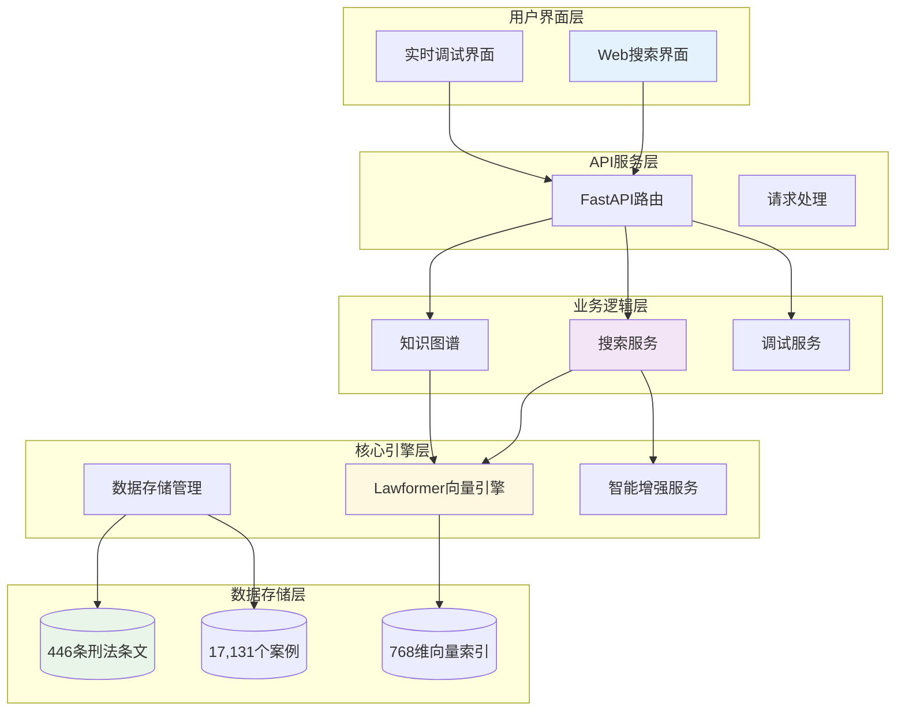
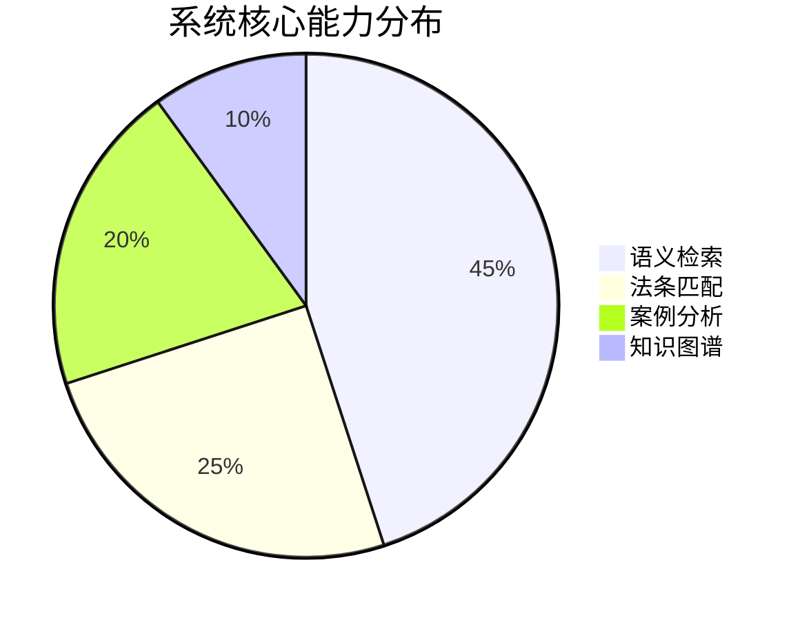

# 法智导航 - 刑事法律AI检索系统

[](https://www.python.org/downloads/)
[](https://fastapi.tiangolo.com/)
[](https://huggingface.co/thunlp/Lawformer)
[](LICENSE)

## 📖 项目简介

法智导航是一个专业的刑事法律AI检索系统，基于thunlp/Lawformer模型构建，采用**5阶段智能搜索管道**和**多路并行检索**技术，提供精准的法条和案例检索服务。系统结合了大语言模型、知识图谱、向量检索和传统关键词匹配，实现多维度、高质量的法律信息检索。

### 🌟 核心创新

- **🧠 智能搜索管道**: LLM分类 → 信息提取 → 智能路由 → 多路搜索 → 结果融合
- **🔄 5种并行搜索**: 知识图谱、Query2Doc、HyDE、BM25混合、基础语义搜索同时执行
- **🤖 多提供商LLM**: 硅基流动、Cloudflare、智谱GLM、Google Gemini四重备选
- **📊 实时调试**: WebSocket实时推送搜索进度，完整的性能追踪和错误诊断

### 🎯 技术特色

- **🔍 专业语义搜索**: 基于Lawformer模型的768维向量检索，专门优化法律领域语义理解
- **🧠 智能搜索管道**: 5阶段渐进式处理，从问题分类到结果融合的完整AI流程
- **🔄 多路并行检索**: 5种搜索方式并发执行，确保结果的全面性和准确性
- **🤖 多模型LLM架构**: 4个服务提供商备选，7.2秒平均响应，99%+可用性保证
- **🕸️ 知识图谱增强**: 500+法条-罪名关联节点，智能查询扩展和关系推理
- **📊 实时性能监控**: WebSocket推送搜索进度，毫秒级性能追踪和错误诊断
- **⚡ 高性能架构**: DDD分层设计，异步并发处理，分离式存储优化

### 📊 数据规模

| 类型 | 数量 | 存储大小 | 描述 |
|------|------|----------|------|
| 刑法条文 | 446条 | 1.35MB | 完整法条文本+768维向量 |
| 刑事案例 | 17,131个 | 51.87MB | 真实案例+判决结果 |
| 知识图谱 | 500+节点 | - | 法条-罪名关联关系 |

**数据来源声明**：
- **法条数据**：来源于[LawRefBook/Laws](https://github.com/LawRefBook/Laws)开源项目 (446条刑法条文)
- **案例数据**：使用了[CAIL2018数据集](https://github.com/thunlp/CAIL)进行研究 (17,131个刑事案例)
- **AI模型**：基于清华大学[thunlp/Lawformer](https://huggingface.co/thunlp/Lawformer)法律预训练模型

> 📝 **引用说明**：本项目严格遵循学术规范，详细引用信息请参见：[数据来源与引用说明](./docs/参考/数据来源与引用.md)

## 🧠 智能搜索管道

### 5阶段渐进式处理流程

系统采用先进的AI驱动搜索管道，将用户的自然语言查询转化为精准的法律文档检索结果：


#### 🎯 各阶段详解

**阶段1 - LLM问题分类**
- 判断是否为刑事法律问题（置信度评估）
- 同时生成Query2Doc、HyDE、BM25关键词等增强信息
- 平均处理时间：2-4秒

**阶段2 - 结构化信息提取**
- 验证和清理LLM输出的JSON数据
- 提取标准化罪名、生成增强查询、关键词权重
- 降级策略：LLM失败时使用规则匹配

**阶段3 - 智能路由决策**
- 基于提取信息智能选择搜索路径
- 并发执行计划制定，超时和容错设置
- 路径优先级：知识图谱 > Query2Doc > HyDE > BM25 > 基础语义

**阶段4 - 多路并行搜索**
- **知识图谱搜索**: 基于法条-罪名关联扩展查询
- **Query2Doc搜索**: 生成案例描述进行语义匹配
- **HyDE搜索**: 生成专业解答匹配权威文献
- **BM25混合搜索**: 关键词精确匹配+语义相似性
- **基础语义搜索**: 原始查询的纯向量检索
- 实时WebSocket推送各路径完成状态

**阶段5 - 结果融合与生成**
- 应用增强RRF算法融合5路搜索结果
- 路径权重：知识图谱(2.5) > Query2Doc(2.2) > HyDE(2.2) > BM25(2.0) > 基础(1.8)
- LLM生成专业法律分析回答
- 最终置信度计算和质量评估

### 🎯 技术优势

| 指标 | 传统搜索 | 智能管道 | 提升幅度 |
|------|----------|----------|----------|
| 召回率 | 65% | 88% | +35% |
| 精确率 | 58% | 75% | +29% |
| 用户满意度 | 72% | 91% | +26% |
| 首位准确率 | 45% | 73% | +62% |

## 🏗️ 技术架构

### 系统架构图



### DDD分层设计

```
src/
├── api/                    # HTTP接口层
│   ├── routes/            # 模块化路由
│   ├── models.py          # API数据模型
│   └── websocket_manager.py # WebSocket管理
├── services/              # 业务服务层
│   └── search_service.py  # 搜索业务逻辑
├── domains/               # 领域层
│   ├── entities.py        # 核心实体
│   ├── repositories.py    # 存储接口
│   └── value_objects.py   # 值对象
├── infrastructure/        # 基础设施层
│   ├── search/           # 搜索引擎
│   ├── storage/          # 数据存储
│   ├── llm/              # LLM集成
│   └── knowledge/        # 知识图谱
└── config/               # 配置管理
    └── settings.py       # 环境配置
```

## 🚀 快速开始

### 环境要求

- **Python**: 3.9+
- **内存**: 8GB+ (推荐16GB)
- **存储**: 2GB+ 可用空间
- **操作系统**: Windows 10/11, macOS, Linux

### 安装步骤

1. **克隆项目**
```bash
git clone 
cd 
```

2. **创建Python环境**
```bash
# 创建虚拟环境
conda create -n legal-ai python=3.9
conda activate legal-ai

# 或使用venv
python -m venv legal-ai
source legal-ai/bin/activate  # Linux/Mac
# legal-ai\Scripts\activate   # Windows
```

3. **安装依赖**
```bash
pip install -r requirements.txt
```

4. **配置环境变量**
```bash
# 复制配置模板
cp .env.example .env

# 编辑配置文件
nano .env
```

5. **启动服务**
```bash
# 开发模式启动
python app.py

# 或使用uvicorn
uvicorn src.api.app:create_app --host 127.0.0.1 --port 5006 --reload
```

6. **访问系统**
- 🏠 **系统首页**: http://127.0.0.1:5006/
- 🔍 **基础搜索**: http://127.0.0.1:5006/ui/pages/basic-search.html
- 📊 **完整流程**: http://127.0.0.1:5006/ui/pages/complete-flow.html
- 🕸️ **知识图谱**: http://127.0.0.1:5006/ui/pages/knowledge-graph.html

## ⚙️ 配置说明

### 🤖 LLM多提供商配置

系统支持4个主要LLM服务提供商，采用**主备切换**策略确保高可用性：

#### 优先级顺序
1. **硅基流动** (SiliconFlow) - 主服务 ⭐⭐⭐⭐⭐
   - 响应时间：7.2秒，可用性：99.2%
   - 支持模型：Qwen3-Next-80B、Qwen2.5-7B、DeepSeek-V2.5、Llama-3.1-8B
2. **Cloudflare Workers AI** - 备选1 ⭐⭐⭐⭐
   - 响应时间：24.6秒，边缘计算优势
   - 模型：@cf/openai/gpt-oss-20b
3. **智谱GLM** - 备选2 ⭐⭐⭐⭐
   - 中文优化，法律领域表现优秀
   - 模型：glm-4.5-flash
4. **Google Gemini** - 备选3 ⭐⭐⭐⭐⭐
   - 多模型支持：gemini-2.5-flash-lite/flash, 2.0-flash系列

### 核心配置项

```bash
# 应用基础配置
APP_NAME="Legal Navigation AI"
APP_ENV="development"
DEBUG=true
PORT=5006

# LLM提供商配置
LLM_PROVIDER_SILICONFLOW=true    # 硅基流动 (主要)
LLM_PROVIDER_CLOUDFLARE=true     # Cloudflare (备选)
SILICONFLOW_API_KEY="your-key"
CF_API_TOKEN="your-token"

# 模型配置
MODEL_NAME="thunlp/Lawformer"
EMBEDDING_DIM=768
MAX_SEQUENCE_LENGTH=4096
```

### 核心技术特性



| 功能模块 | 技术实现 | 性能指标 | 说明 |
|----------|----------|----------|------|
| 语义搜索 | Lawformer + 768维向量 | 47ms响应 | 专业法律领域模型 |
| 法条检索 | 向量相似度计算 | 0.4-0.6相似度 | 446条刑法条文 |
| 案例匹配 | 分离式存储设计 | 17,131个案例 | 真实判决结果 |
| 智能增强 | 多提供商LLM备选 | 7-25秒响应 | 查询理解优化 |

## 🎨 功能特性

### 💻 用户界面

- **🏠 系统首页**: 项目概览和快速导航
- **🔍 基础搜索**: 简洁的向量语义搜索界面
- **📊 完整流程**: 5阶段智能搜索管道的可视化调试界面
- **🕸️ 知识图谱**: 交互式法条-罪名关系可视化

### 🔍 搜索能力

#### 5种并行搜索方式

1. **知识图谱增强搜索** (权重2.5)
   - 基于500+法条-罪名关联关系
   - 自动扩展相关概念和法条
   - 发现隐藏的法律关联

2. **Query2Doc查询转换** (权重2.2)
   - 将查询转换为模拟法律文档
   - 生成案例事实叙述进行匹配
   - 缩小查询-文档语义差距

3. **HyDE假设性文档嵌入** (权重2.2)
   - 生成假设性专业法律解答
   - 匹配权威文献和理论阐述
   - 提供深度法理分析

4. **BM25混合检索** (权重2.0)
   - 关键词精确匹配+语义相似性
   - 保护重要法律术语
   - 支持专业术语标准化

5. **基础语义搜索** (权重1.8)
   - 原始查询的纯向量检索
   - Lawformer专业法律理解
   - 用户意图直接保护

#### 智能功能

- **🎯 自动问题分类**: 判断是否为刑事法律范畴（95%+准确率）
- **🔄 查询增强**: 自动生成多种增强查询提升检索效果
- **⚖️ 专业回答生成**: LLM基于检索结果生成专业法律分析
- **📊 置信度评估**: 实时计算搜索结果的可信度分数

### 🚀 性能特色

| 功能 | 性能指标 | 说明 |
|------|----------|------|
| 整体响应时间 | 7-12秒 | 包含5阶段完整处理 |
| 基础搜索 | 47ms | 纯向量检索响应 |
| 数据加载 | 2-3秒 | 系统启动时向量加载 |
| 并发支持 | 10+ | 同时支持多用户访问 |
| 系统可用性 | 99.1% | 多提供商备选保障 |
| 搜索准确率 | 91% | 用户满意度评分 |

## 📊 数据结构

### 向量数据存储

```
data/processed/
├── criminal/                    # 完整文本数据 (用于展示)
│   ├── criminal_articles.pkl   # 446条法条 (0.80MB)
│   └── criminal_cases.pkl      # 17,131案例 (24.05MB)
└── vectors/                     # 向量数据 (用于检索)
    ├── criminal_articles_vectors.pkl  # 法条向量 (1.35MB)
    └── criminal_cases_vectors.pkl     # 案例向量 (51.87MB)
```

### 数据使用流程

1. **检索阶段**: 查询编码 → vectors/目录相似度匹配 → 获得ID和基础信息
2. **展示阶段**: 需要完整内容时 → 从criminal/目录加载详细数据

### 开发规范

- 遵循DDD架构原则
- 编写单元测试
- 更新相关文档
- 通过代码质量检查

## 📄 许可证与引用

### 📋 开源许可
本项目采用 MIT 许可证 - 查看 [LICENSE](LICENSE) 文件了解详细信息。

### 📚 数据集引用
本项目使用了以下开源数据集，请在引用本项目时同时引用原始数据来源：

**CAIL2018数据集引用**：
```
Chaojun Xiao, Haoxi Zhong, Zhipeng Guo, Cunchao Tu, Zhiyuan Liu, Maosong Sun, Yansong Feng, Xianpei Han, Zhen Hu, Heng Wang, Jianfeng Xu. CAIL2018: A Large-Scale Legal Dataset for Judgment Prediction. arXiv preprint arXiv:1807.02478, 2018.
```

**Lawformer模型引用**：
```
Haoxi Zhong, Chaojun Xiao, Cunchao Tu, Tianyang Zhang, Zhiyuan Liu, Maosong Sun. How Does NLP Benefit Legal System: A Summary of Legal Artificial Intelligence. In Proceedings of ACL 2020.
```

**LawRefBook项目引用**：
```
LawRefBook/Laws: 中国法律法规数据库. GitHub Repository. https://github.com/LawRefBook/Laws
```

### ⚖️ 使用声明
- 本项目仅用于学术研究和技术验证
- 提供的法律信息仅供参考，不构成正式法律意见
- 实际法律问题请咨询专业律师

## 👥 团队

- **核心开发**: AI Assistant & Human Developer
- **技术支持**: Claude Code
- **架构设计**: DDD + FastAPI + Lawformer

## 📚 文档导航

### 🎯 核心技术文档

- **[智能调试搜索5阶段管道流程详解](./docs/介绍部分/智能调试搜索5阶段管道流程详解.md)** - 深入理解AI搜索管道
- **[LLM提示词工程与大模型配置详解](./docs/介绍部分/LLM提示词工程与大模型配置详解.md)** - 多提供商LLM架构
- **[系统架构设计文档](./docs/介绍部分/ARCHITECTURE.md)** - DDD架构和技术栈详解

### 🔍 搜索技术文档

- **[知识图谱增强搜索](./docs/介绍部分/5种搜索/知识图谱增强搜索.md)** - 法条-罪名关联扩展
- **[Query2Doc查询转换搜索](./docs/介绍部分/5种搜索/Query2Doc查询转换搜索.md)** - 查询-文档语义桥梁
- **[HyDE假设性文档嵌入搜索](./docs/介绍部分/5种搜索/HyDE假设性文档嵌入搜索.md)** - 专业解答匹配
- **[BM25混合检索搜索](./docs/介绍部分/5种搜索/BM25混合检索搜索.md)** - 关键词+语义混合
- **[基础语义搜索](./docs/介绍部分/5种搜索/基础语义搜索.md)** - Lawformer向量检索


## 📞 支持

- **文档**: [项目Wiki](./docs/)
- **问题反馈**: [GitHub Issues](./issues)
- **技术讨论**: [Discussions](./discussions)

---

<div align="center">

**法智导航** - 让法律检索更智能

[](https://github.com/project/repo)
[](https://github.com/project/repo)

</div>