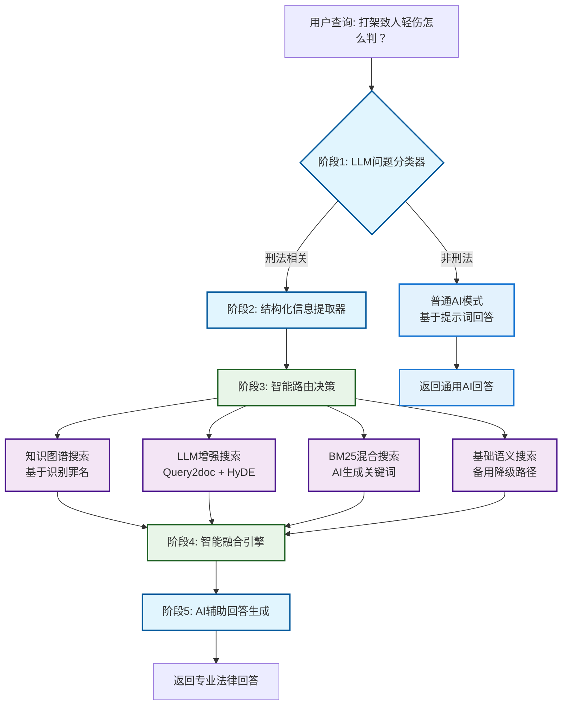
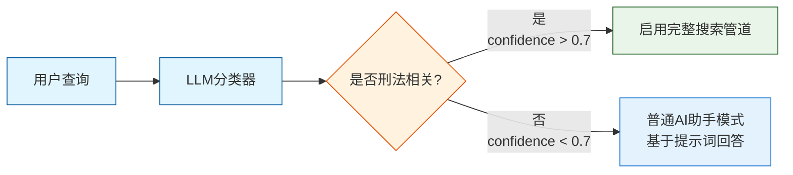
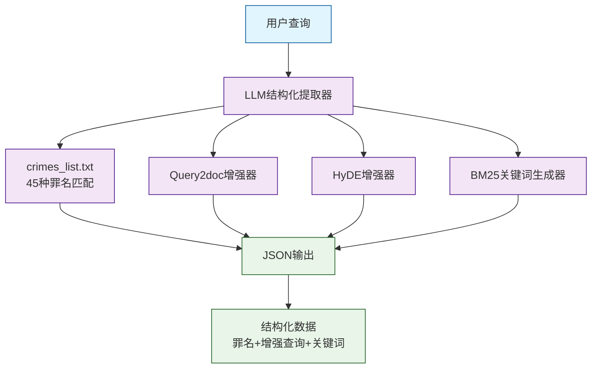
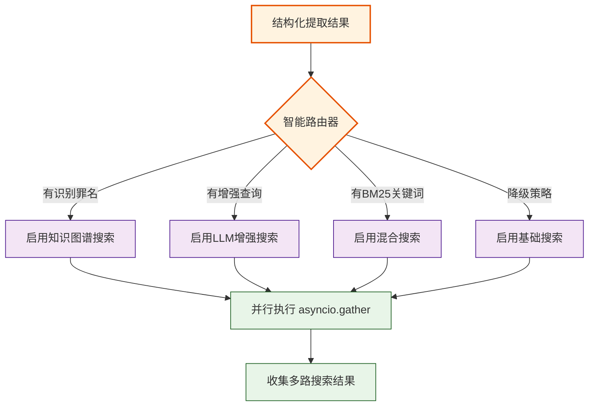
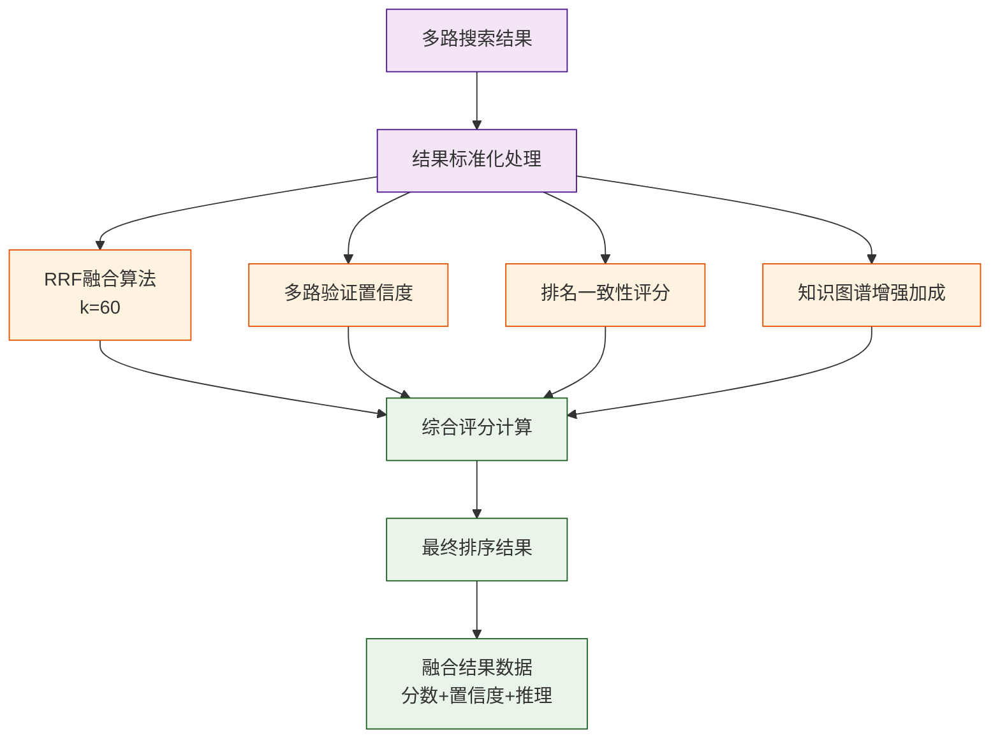
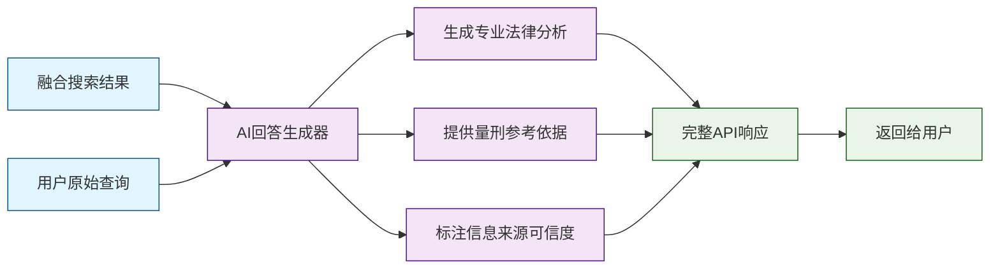
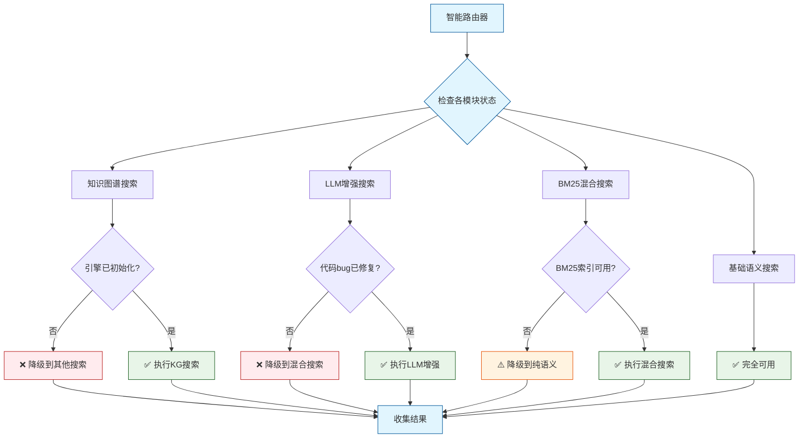
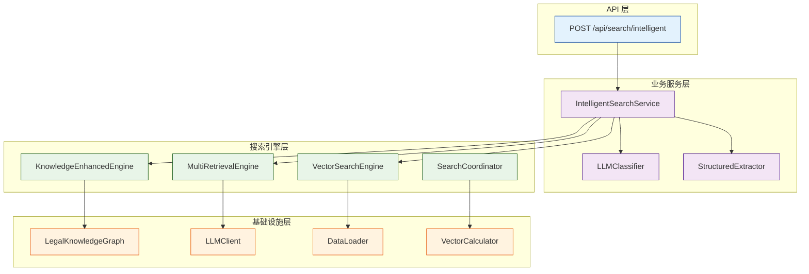
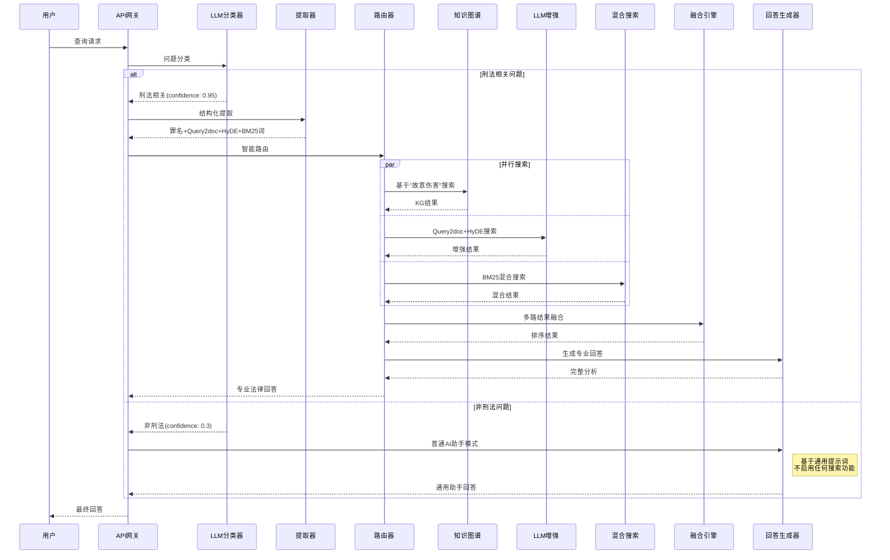
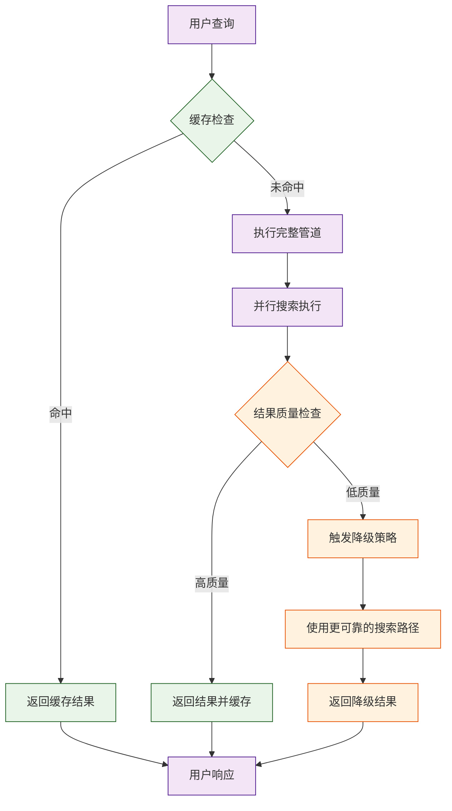

# AI驱动刑法智能检索管道 - 流程图

基于Mermaid图表语法的完整数据流程可视化

---

## 🔄 完整流程图

---

## 📊 详细阶段流程图

### 阶段1: LLM问题分类

### 阶段2: 结构化信息提取

### 阶段3: 智能路由决策

### 阶段4: 智能融合引擎

### 阶段5: AI辅助回答生成

---

## 🔍 模块状态流程图

---

## 🏗️ 技术架构流程图

---

## 🎯 数据流转图

---

## 📈 性能优化流程图

