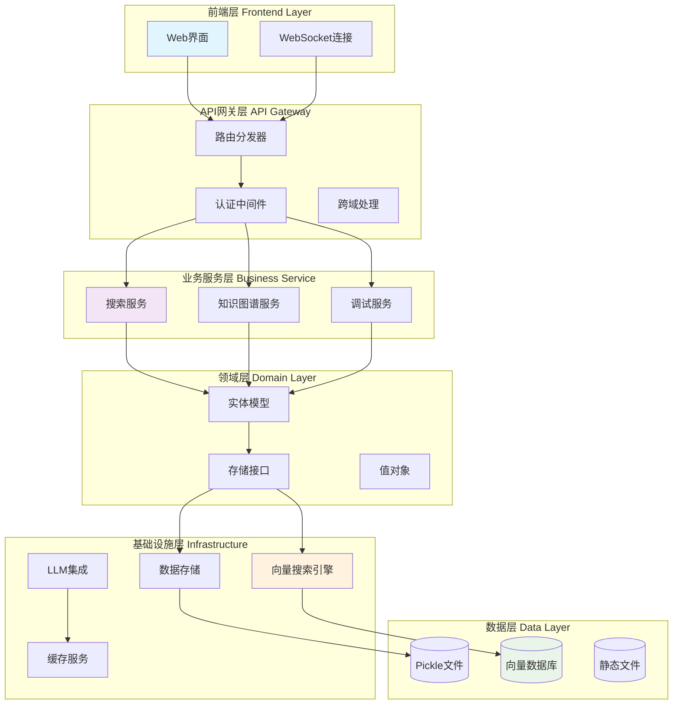
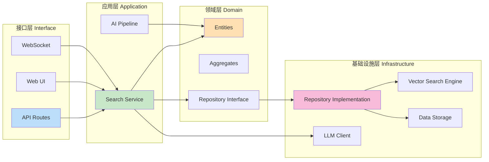
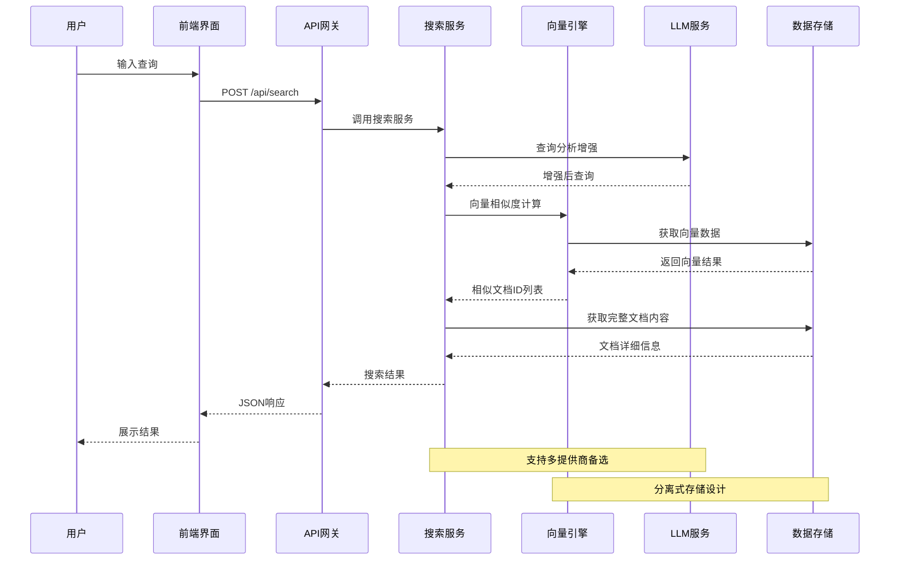
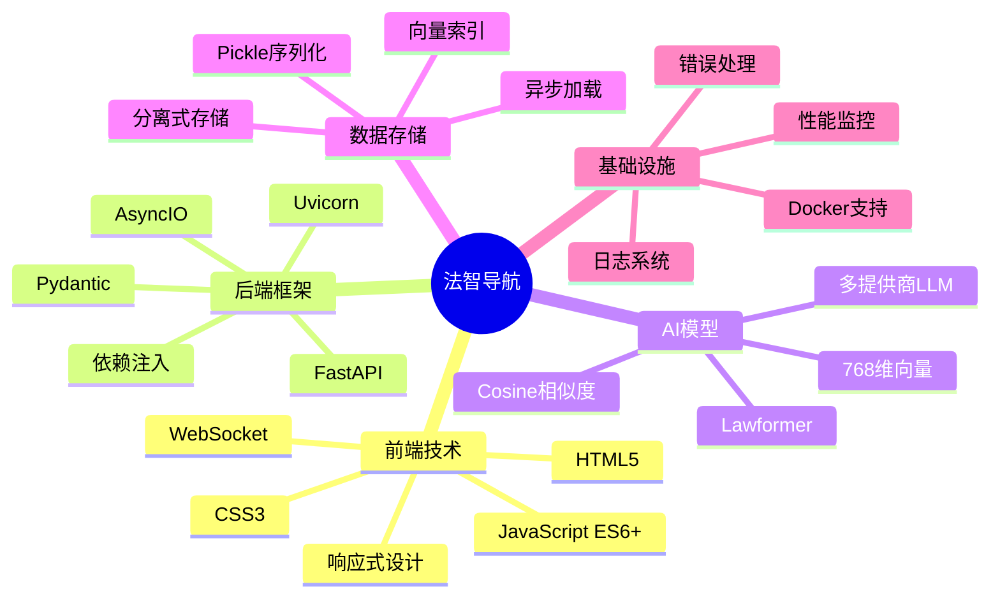
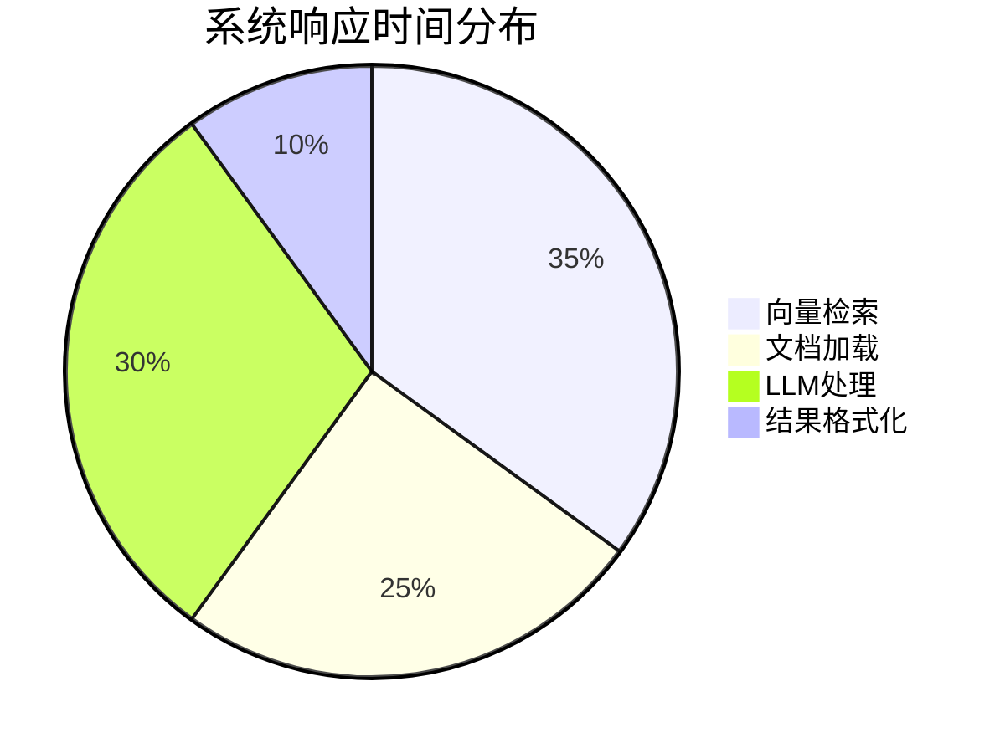
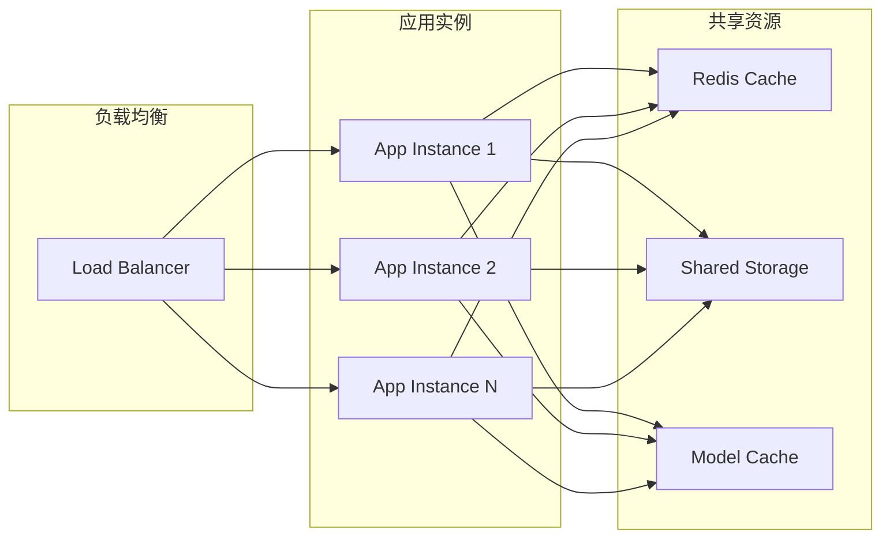
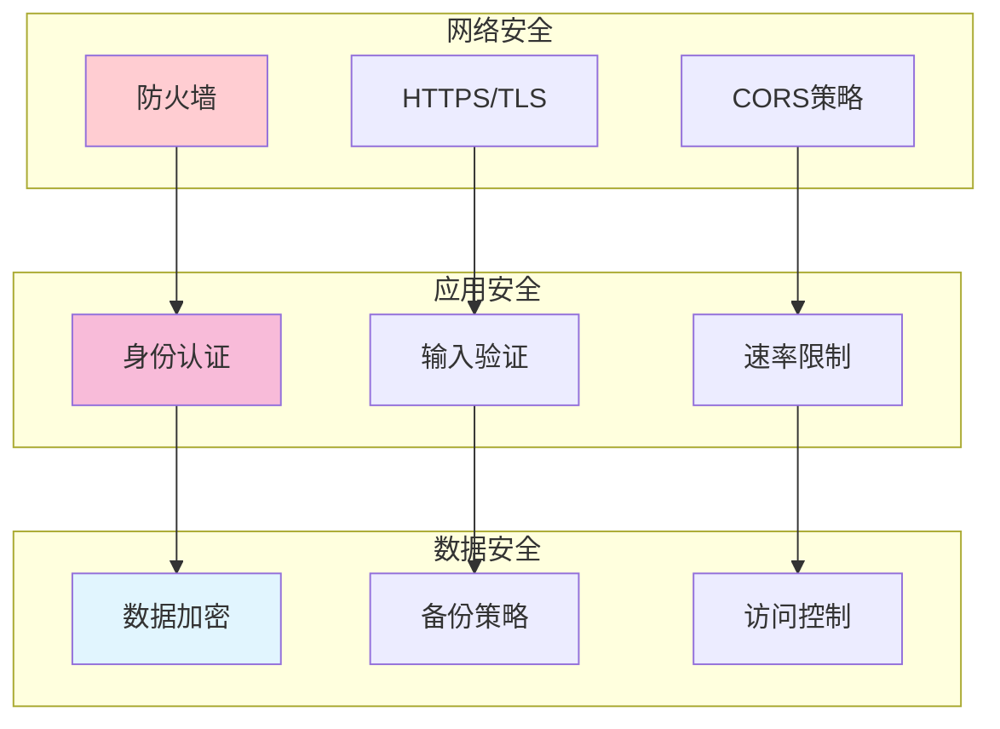
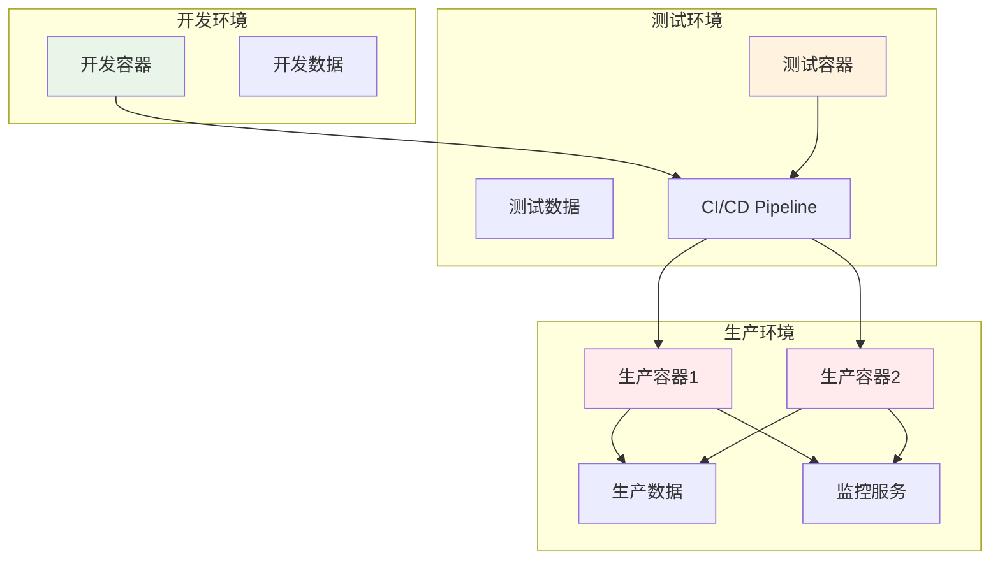

# 系统架构设计文档

## 🏗️ 整体架构

### 1. 系统架构图 (Mermaid)

### 2. DDD分层架构

### 3. 数据流架构

## 🔧 技术栈架构

### 核心技术组件

## 📊 性能架构

### 响应时间分布

### 并发处理能力

## 🛡️ 安全架构

### 安全层级设计

## 🔄 部署架构

### 容器化部署

---

*本架构文档基于DDD设计原则，确保系统的可维护性、可扩展性和高性能。*