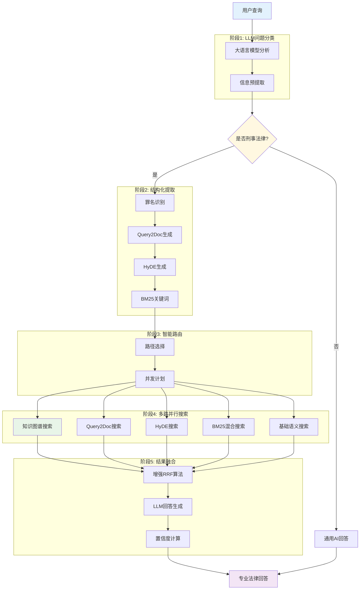

# 智能调试搜索5阶段管道完整流程图

```mermaid
graph TB
    USER[用户查询]

    subgraph "阶段1: LLM问题分类"
        CLASSIFY[大语言模型分析]
        EXTRACT[信息预提取]
    end

    DECISION{是否刑事法律?}
    GENERAL[通用AI回答]

    subgraph "阶段2: 结构化提取"
        CRIMES[罪名识别]
        QUERY2DOC[Query2Doc生成]
        HYDE[HyDE生成]
        KEYWORDS[BM25关键词]
    end

    subgraph "阶段3: 智能路由"
        ROUTE_PLAN[路径选择]
        PARALLEL[并发计划]
    end

    subgraph "阶段4: 多路并行搜索"
        KG_SEARCH[知识图谱搜索]
        Q2D_SEARCH[Query2Doc搜索]
        HYDE_SEARCH[HyDE搜索]
        BM25_SEARCH[BM25混合搜索]
        BASIC_SEARCH[基础语义搜索]
    end

    subgraph "阶段5: 结果融合"
        RRF[增强RRF算法]
        LLM_GEN[LLM回答生成]
        CONFIDENCE[置信度计算]
    end

    FINAL[专业法律回答]

    USER --> CLASSIFY
    CLASSIFY --> EXTRACT
    EXTRACT --> DECISION
    DECISION -->|是| CRIMES
    DECISION -->|否| GENERAL

    CRIMES --> QUERY2DOC
    QUERY2DOC --> HYDE
    HYDE --> KEYWORDS
    KEYWORDS --> ROUTE_PLAN

    ROUTE_PLAN --> PARALLEL
    PARALLEL --> KG_SEARCH
    PARALLEL --> Q2D_SEARCH
    PARALLEL --> HYDE_SEARCH
    PARALLEL --> BM25_SEARCH
    PARALLEL --> BASIC_SEARCH

    KG_SEARCH --> RRF
    Q2D_SEARCH --> RRF
    HYDE_SEARCH --> RRF
    BM25_SEARCH --> RRF
    BASIC_SEARCH --> RRF

    RRF --> LLM_GEN
    LLM_GEN --> CONFIDENCE
    CONFIDENCE --> FINAL
    GENERAL --> FINAL

    style USER fill:#e3f2fd
    style DECISION fill:#fff8e1
    style KG_SEARCH fill:#e8f5e8
    style FINAL fill:#f3e5f5
```